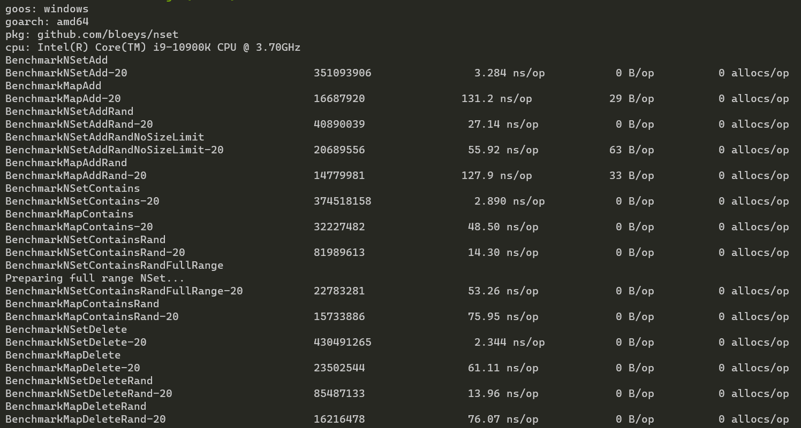

# NSet

NSet is a super fast and memory efficient set implementation built for unsigned integers up to and including uint32.

By 'set' we mean something like a hash map, but instead of key/value pairs there are only keys.
You can do the normal operations of add, check if item exists, and delete, but you can also do things like union sets and
get intersections.

**Contents**:

- [NSet](#nset)
  - [When to use NSet](#when-to-use-nset)
  - [Usage](#usage)
  - [Benchmarks](#benchmarks)
  - [How NSet works](#how-nset-works)
    - [Memory characteristics](#memory-characteristics)

## When to use NSet

Maybe you want a set implementation? Then this is one, but there are other reasons.

If you are using your hash maps/arrays like sets or do a lot of checks to see if items exists in your hash maps then NSet might make sense.
In such cases NSet makes sense because it is both faster and more memory efficient. You can see more about this in the [Benchmarks](#benchmarks) section.

Here are some examples where you might want to consider NSet:

``` go
//You might be using maps mostly for checking if things exist:

//This map is being used like a set. Some people might also do: make(map[uint32]bool, 0)
mapOfIds := make(map[uint32]struct{}, 0)

//Fill map here...

someId := 54312
if _, ok:= mapOfIds[someId]; ok {
    //Do something
} else {
    //Something else
}
```

```go
//You might be searching arrays a lot
func ExistsInArray(myArray []int, item int) bool {

    for i := 0; i < len(myArray); i++ {
        if myArray[i] == item {
            return true
        }
    }

    return false
}
```

## Usage

To install run `go get github.com/bloeys/nset`

Then usage is very simple:

```go
mySet := nset.NewNSet[uint32]()

mySet.Add(0)
mySet.Add(300)
mySet.Add(256)
mySet.Add(4)

if mySet.Contains(5) {
    panic("Oops I don't want 5!")
}

mySet.Remove(4)

```

## Benchmarks

NSet is faster than the built-in Go hash map in all operations (add, check, delete) by `~50% to ~3900%` depending on the operation and data size.

In the benchmarks below, ones that have 'Rand' in the name mean that access patterns are randomized to test certain use cases.
To make sure the test is fair the seed is the same for both Go Map and NSet. Here both suffer slowdowns but NSet remains faster.

Adding all uint32 to the map would eat tons of RAM, so we limit both NSet and Map to 10 Million values (0->10M). But because
NSet is optimized for this, there are two additional benchmarks that are only for NSet: `NSetRandNoSizeLimit` and `NSetContainsRandFullRange`.

NSetAddRandNoSizeLimit removes the limit on the values so NSet will potentially get 10s or 100s of millions of random values.
Even with no limit, NSet outperforms the Map thats limited to 10M by ~200%.

NSetContainsRandFullRange adds all 4 billion Uint32 values to NSet then randomly checks if they exist. This is by far
the most extreme test, but is still faster than access on a map with 400x less values. A less loaded NSet performs better,
but the difference between best case and worst case NSet is minor and doesn't increase much as the storage increases.

Benchmark with 100 elements (Ignore NSetContainsRandFullRange and NSetContainsRandFullRange):


Benchmark with 100,000,000 elements:



As can be seen from the benchmarks, NSet has relatively small change in its performance even with 100 million elements, while the
hash map slows down a lot as the size grows.

NSet also allocates less, and in fact will only allocate when adding a number bigger than all previously entered numbers.

```go
//This map already has space for ~100 elements and so doesn't need to resize, which is costly
myMap := make(map[uint16], 100)
```

Map benefits from sizing while NSet isn't affected, but in both cases NSet remains faster.

## How NSet works

NSet works by using a single bit to indicate whether a number exists or not.
These bit flags are stored as an array of uint64, where the `0` uses the first bit of the first uint64,
`1` uses the second bit of the first uint64 in the array and so on. So each uint64 represents 64 numbers.

Now assume we have added the numbers `1`, `2` and `3`, then we add number `65`. The first 3 numbers fit in the first uint64 integer of the array, but `65` doesn't
so at this point the array is expanded until we have enough 65 bits or more, so 1 more integer is added and the second bit of the second integer is set.

### Memory characteristics

This setup gives us very high add/get/remove efficiency, but in some cases can produce worse memory usage. For example, if you make an empty set
then add the number `5000` NSet will be forced to create 78 integers and then set one bit on the last integer. So if you have a few huge numbers (a number in the millions or billions) then you will be using more memory than a hash map or an array.

But if your numbers are smaller and/or closer together then you will have **a lot better** memory efficiency. A normal array storing all
4 billion uint32 integers will use `16 GB` of memory, while NSet can store all 4 billion integers with only use `512 MB`.

To improve the worst case scenario, which happens when someone just adds the number $2^{32}$ and nothing else (which uses 512 MB), NSet
is split into 128 `buckets`, where each bucket can represent a maximum of $2^{25}$ (~33 million) values.

The upper 7 bits of a value are used to select a bucket, then the number is placed in a position in that bucket depending on its value
and excluding the bits used by the bucket.

With this the worst case (e.g. adding MaxUint32) will only increase usage by **up to** `16 MB`.

> tldr: NSet will use a max of 512 MB when storing all uint32 (as opposed to 16GB if you used an array/map), but it might reach this max before
> adding all uint32 numbers.
